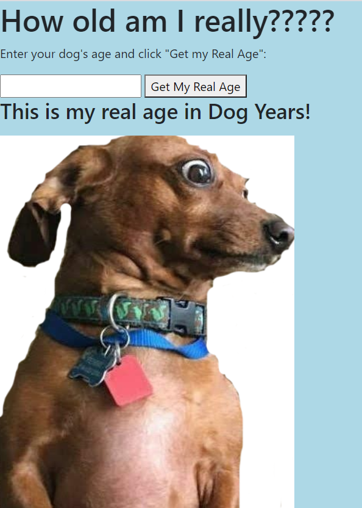
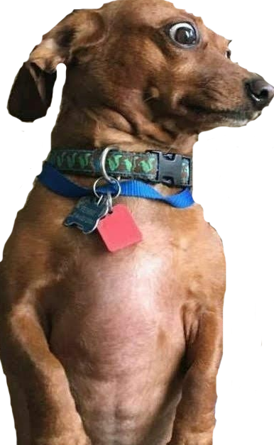

# OdyApp

## Jennifer Detmering

## Description-

### Odi App converts your dogs age in human years into dog years using a function I wrote in javascript.

#### 

## Table of Contents

1. [Installation](#installation)
2. [Usage](#usage)
3. [Technologies Used](#technologies_used)
4. [Credits](#credits)
5. [License](#license)
6. [Features](#features)
7. [Questions and Contributions](#questions_and_contributions)
8. [Tests](#tests)

## Installation-

# [Use OdyApp](https://kodiakshuksan.github.io/OdyApp/)

## Usage-

## Technologies Used-

npm, CSS, JavaScript, node.js, HTML, Jest

## Credits-

[w3 schools](https://w3schools.com)

## License-

### [License: MIT](https://opensource.org/licenses/MIT)

## Features-

### Uses HTML, CSS, JavaScript, and the users input to determine the dog's age in dog years using a JavaScript function.

## Questions and Contributions-

### GitHub Profile: https://github.com/kodiakshuksan

### Email: kodiakshuksan@yahoo.com

## Tests-

### node run test
